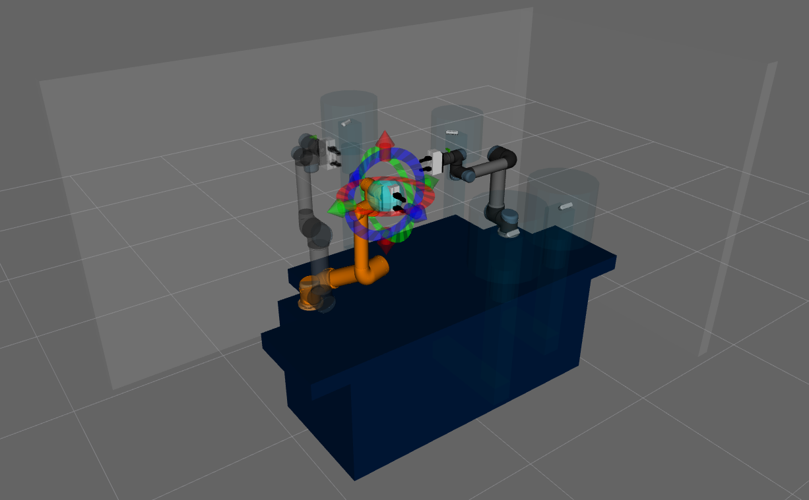

<table>
  <tr>
    <td></td>
    <td><h1>PRL MANTIS</h1></td>
  </tr>
</table>

## **Project Overview**

This project integrates a ROS 2 development environment with Docker and provides packages for the description and simulation of the UR5 workbench, developed by the Paris Robotics Lab and referred to as **Mantis**.

<div align="center">
     
</div>

## **Included Packages**

### 1. **docker-ros2**
This package provides a Docker environment for developing with ROS 2 (jazzy), including the **UR Driver** to interact with UR robots (UR3, UR5, UR10, etc.). The container is configured to work with these robots and includes all necessary tools for simulation and communication with both physical and simulated robots.

### 2. **prl_ur5_description**
The `prl_ur5_description` package provides the Mantis description, including 3D models files necessary for visualizing and simulating the UR5 robot in a ROS 2 environment. 

### 3. **prl_ur5_gazebo**
The `prl_ur5_gazebo` package provides the Mantis launch and files, necessary for simulating the UR5 robot in Gazebo.

### 4. **prl_ur5_control**
The `prl_ur5_control` package provides configuration files for ROS 2 controllers and launch files to spawn the **Mantis** parts' different controllers.

### 5. **prl_ur5_moveit**
The `prl_ur5_moveit` package provides configuration and launch files to control the UR5 robot using various path planning solvers in ROS 2 with MoveIt.

### 6. **prl_ur5_run**
The `prl_ur5_run` package provides a launch file to access the real robot by starting the driver and enabling control.
---

## **Prerequisites**

- Docker must be installed on your machine (Tested on `linux/amd64`, not supported on ARM).
- A compatible version of ROS 2 (Humble) must be installed and configured.
- Gazebo for simulating the UR5 robot (if you intend to use simulation).

---

## **Installation**

### **1. Docker Setup (for `docker-ros2`)**

**See [docker-ros2/README.md](docker-ros2/README.md)**

---

### **2. Install `prl` Packages**

Follow the steps below to set up the `prl` packages. These steps can be performed both inside and outside (only if you have ros2 jazzy locally) the Docker container. Ensure that the setup is done in the shared folder to maintain consistency and accessibility.

> [!IMPORTANT]
> Before proceeding with the setup, ensure you follow good practices for organizing your ROS 2 workspace. Create a folder to contain all your ROS 2 setup files. You can name it as you prefer, but in this guide, we will use `ws`. Inside this folder, create another folder named `src` to hold the source files.

To create these folders, use the following commands:
#### If you are using Docker

```bash
cd ~/share
mkdir -p ws/src
```

#### If you are working locally on your machine

```bash
mkdir -p ~/ws/src
```

This will create the `ws` directory in your home folder and the `src` directory inside it.

> [!WARNING]
> Remember that in the container, any changes made outside the `share` directory will not be saved after you shut down the container.

#### Clone the prl repository into your ROS 2 workspace:

```bash
cd ws/src
git clone https://github.com/inria-paris-robotics-lab/prl_ur5_ros2.git
```

#### Install Dependencies

The **prl_ur5_description** package requires the following dependencies:

- [prl_ur5_robot_configuration](https://github.com/inria-paris-robotics-lab/prl_ur5_robot_configuration)
- [universal_robot_description](https://github.com/UniversalRobots/Universal_Robots_ROS2_Description)
- [universal_robot_gazebo](https://github.com/UniversalRobots/Universal_Robots_ROS2_GZ_Simulation/tree/ros2)
- [rq_fts_ros2_driver](https://github.com/panagelak/rq_fts_ros2_driver)
- [realsense-ros](https://github.com/IntelRealSense/realsense-ros)
- [weiss_wsg50_ros](https://github.com/inria-paris-robotics-lab/wsg50-ros-pkg)
- [OrbbecSDK_ROS2](https://github.com/orbbec/OrbbecSDK_ROS2/tree/v2-main)


These packages provide configuration files, robot descriptions, simulation models, and force-torque sensor drivers that are necessary for the UR5 robot to operate properly in a ROS2 ecosystem.

To install these dependencies, clone them into your workspace using the following commands:

```bash
cd ws/src
vcs import < prl_ur5_ros2/dependencies.repos 
```
> [!WARNING]
>  If you plan to use the Orbbec Femto Mega, you must install the Orbbec SDK ROS 2 on your local machine. Follow these steps:

1. Clone the Orbbec SDK ROS 2 repository:
  ```bash
  git clone https://github.com/orbbec/OrbbecSDK_ROS2.git -b v2-main
  ```

2. Install the udev rules:
  ```bash
  cd OrbbecSDK_ROS2/orbbec_camera/scripts
  sudo bash install_udev_rules.sh
  sudo udevadm control --reload-rules && sudo udevadm trigger
  ```

Ensure these steps are completed before proceeding with the setup.

#### Install Workspace dependencies

> [!IMPORTANT]
> To install dependencies and build the packages, you must have ROS 2 Jazzy installed locally. If you do not have ROS 2 Jazzy on your system, use the provided Docker environment (`docker-ros2`) for building and development.

After cloning the dependencies, check and install others dependencies linked to each packages with `rosdep`:

```bash
cd ..
sudo apt update
rosdep init
rosdep update
rosdep install -r --from-paths . --ignore-src --rosdistro $ROS_DISTRO -y
```

#### Build and source the Workspace

After you had installed all dependencies you can build every packages with 'colcon':

> [!NOTE]
> After the build, you may see an error related to the realsense package. You can ignore this error, as it does not affect the setup.


```bash
colcon build --symlink-install --packages-skip robotiq_ft_sensor_hardware
```

Once the build process is finished, source your workspace so that ROS 2 recognizes the new packages:

> [!IMPORTANT]
> If you reopen your Docker container after installation, or open a new terminal (e.g., using byobu, tmux, etc.), you need to source the workspace again to be able to launch the project or see the running nodes in different terminals.

```bash
source install/setup.bash
```

### **3. Setup Your Environment**

Before using Mantis, you need to make a few modifications to the configuration.
### **prl_ur5_robot_configuration**

To configure your setup, edit the `prl_ur5_robot_configuration/config/standard_setup.yaml` file. Update the following parameters to match your hardware and network setup:

- **IP Address and Ports**: Specify the network interface and ports for the robot.
- **Cameras**: Configure the hand-eye cameras, including their model and pose.
- **Gripper Type**: Define the type of gripper being used and its corresponding controller.
- **Fixed Camera**: Set up any fixed cameras required for your application.

Ensure all parameters are correctly adjusted to reflect your specific setup.

### **4. Usage Tips**

### **Use with Simulate Mantis**

> [!NOTE]
> The following instructions are simple examples. For the full list of launch arguments, refer to the README file in each respective package.

#### Only visualize Mantis in RViz

```bash
ros2 launch prl_ur5_description view_mantis.launch.py
```

#### Simulate Mantis in Gazebo and Visualize in RViz

To simulate Mantis in Gazebo and visualize it in RViz, use the following command:

```bash
ros2 launch prl_ur5_gazebo start_gazebo_sim.launch.py
```

### **Using Simulation and MoveIt**

To use MoveIt with the Mantis, you can launch the simulation with the following command:

```bash
ros2 launch prl_ur5_run sim.launch.py
```

Alternatively, you can customize the launch by enabling or disabling specific components such as RViz, Gazebo GUI, or MoveIt. Use the following command with the desired parameters:

```bash
ros2 launch prl_ur5_run sim.launch.py launch_rviz:=<true|false> gazebo_gui:=<true|false> launch_moveit:=<true|false>
```

Replace `<true|false>` with `true` to enable or `false` to disable each component as needed.


### **Use with Real Robot**

To use the UR5 robot with a real setup, you need to modify the robot's network information in the standard setup file of the `prl_ur5_robot_configuration` package.

#### **Launch and Control the real Mantis**

Use the following command to launch control of the real robot with moveit:

```bash
ros2 launch prl_ur5_run real.launch.py
```
Alternatively, you can customize the launch by enabling or disabling specific components such as RViz or MoveIt. Use the following command with the desired parameters:
```bash
ros2 launch prl_ur5_run real.launch.py launch_rviz:=<true|false> launch_moveit:=<true|false>
```
Replace `<true|false>` with `true` to enable or `false` to disable each component as needed.

---

## **Important Notes**
For users intending to use the setup locally:
- **ROS 2 Version**: Ensure you are using a compatible version of ROS 2. This guide assumes ROS 2 Humble.
- **Gazebo**: Verify that Gazebo is installed and properly configured to work with ROS 2 for simulation purposes.

**Dependency Issues**: If you face any issues with dependencies, refer to the individual documentation or open an issue in the relevant repository.
