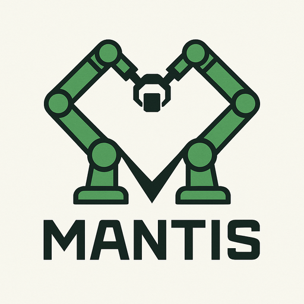
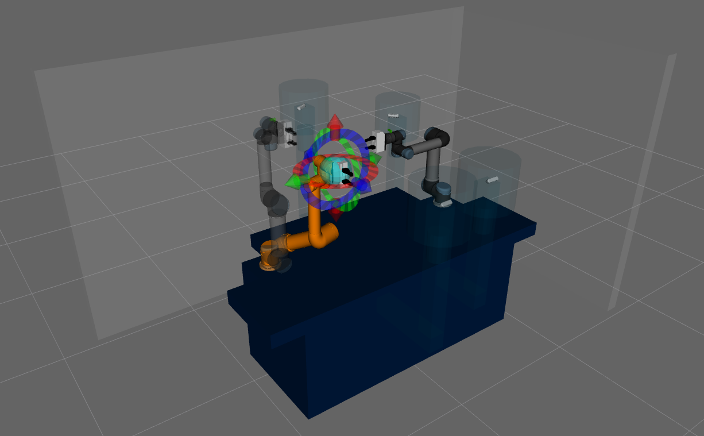

<table>
  <tr>
    <td></td>
    <td><h1>PRL MANTIS</h1></td>
  </tr>
</table>

## **Table of Contents**
1. [Project Overview](#project-overview)
2. [Included Packages](#included-packages)
3. [Prerequisites](#prerequisites)
4. [Installation](#installation)
   - [Docker Setup](#1-docker-setup-for-docker-ros2)
   - [Build and Source Workspace](#rebuild-and-source-the-workspace)
   - [Setup Your Environment](#3-setup-your-environment)
5. [Usage Tips](#4-usage-tips)
   - [Simulation in RViz](#only-visualize-mantis-in-rviz)
   - [Simulation in Gazebo + RViz](#simulate-mantis-in-gazebo-and-visualize-in-rviz)
   - [Using Simulation and MoveIt](#using-simulation-and-moveit)
   - [Using Real Robot](#use-with-real-robot)
6. [Important Notes](#important-notes)

---

## **Project Overview**

This project integrates a ROS 2 development environment with Docker and provides packages for the description and simulation of the UR5 workbench, developed by the Paris Robotics Lab and referred to as **Mantis**.

<div align="center">
     
</div>

---

## **Included Packages**

### 1. **docker-ros2**
Provides a Docker environment for developing with ROS 2 (jazzy), including the **UR Driver** to interact with UR robots (UR3, UR5, UR10, etc.). The container includes all necessary tools for simulation and communication with both physical and simulated robots.

### 2. **prl_ur5_description**
Contains the Mantis description, including 3D model files necessary for visualizing and simulating the UR5 robot in ROS 2.

### 3. **prl_ur5_gazebo**
Launch files and configuration for simulating the UR5 robot in Gazebo.

### 4. **prl_ur5_control**
Configuration files for ROS 2 controllers and launch files to spawn controllers for Mantis parts.

### 5. **prl_ur5_moveit**
Configuration and launch files to control the UR5 robot using path planning solvers in ROS 2 with MoveIt.

### 6. **prl_ur5_run**
Launch file to access the real robot by starting the driver and enabling control.

---

## **Prerequisites**

- Docker installed (tested on `linux/amd64`; not supported on ARM).  
- Compatible version of ROS 2 (Humble).  
- Gazebo for simulation if intended.  

---

## **Installation**

### 1. Docker Setup (for `docker-ros2`)

**See [docker-ros2/README.md](docker-ros2/README.md)**

Create a shared folder on your host machine that will be mounted inside the Docker container:
```bash
mkdir ~/docker_shared
````

Build and run the Docker container using the provided script:

```bash
cd prl_ur5_ros2/docker_ros2
./start_docker.bash my_container ~/docker_shared ros
```

> [!TIPS]
> If you want to disable GPU sharing, add the `--no-gpu` option when running the `./start_docker.bash` script.


> [!WARNING]
>  If you plan to use the Orbbec Femto Mega, you must install the Orbbec SDK ROS 2 on your local machine. Follow these steps:

```bash
git clone https://github.com/orbbec/OrbbecSDK_ROS2.git -b v2-main
cd OrbbecSDK_ROS2/orbbec_camera/scripts
sudo bash install_udev_rules.sh
sudo udevadm control --reload-rules && sudo udevadm trigger
```

---

### Rebuild and Source the Workspace

After installing dependencies, rebuild all packages:

> [!NOTE]
> After the build, you may see an error related to the realsense package. You can ignore this error, as it does not affect the setup.


```bash
colcon build --symlink-install
source install/setup.bash
```

---

### 3. Setup Your Environment

Modify configuration files to reflect your specific setup.

> [!IMPORTANT]
> Refer to [prl_ur5_robot_configuration README](https://github.com/inria-paris-robotics-lab/prl_ur5_robot_configuration) for network and robot setup.

---

## 4. Usage Tips

> [!IMPORTANT]
> If you want to use different controller than the default loaded one, you can modify the `controllers_setup.yaml` file in the `prl_ur5_robot_configuration` package to load the desired controller by default when launching the real robot. Please verify that the controller match with a controller into the `plr_ur5_control/config/dual_arm_controller.yaml` package.

### Only visualize Mantis in RViz

```bash
ros2 launch prl_ur5_description view_mantis.launch.py
```

### Simulate Mantis in Gazebo and Visualize in RViz

```bash
ros2 launch prl_ur5_gazebo start_gazebo_sim.launch.py
```

### Using Simulation and MoveIt

```bash
ros2 launch prl_ur5_run sim.launch.py
```

##### Customize components (RViz, Gazebo GUI, MoveIt):

Alternatively, you can customize the launch by enabling or disabling specific components such as RViz, Gazebo GUI, or MoveIt. Use the following command with the desired parameters:
```bash
ros2 launch prl_ur5_run sim.launch.py launch_rviz:=<true|false> gazebo_gui:=<true|false> launch_moveit:=<true|false>
```

---

### Use with Real Robot

To use the UR5 robot with a real setup, you need to modify the robot's network info in `standard_setup.yaml` of the prl_ur5_robot_configuration package.

Launch control of the real robot:

```bash
ros2 launch prl_ur5_run real.launch.py
```

##### Optional customization:
Alternatively, you can customize the launch by enabling or disabling specific components such as RViz or MoveIt. Use the following command with the desired parameters:

```bash
ros2 launch prl_ur5_run real.launch.py launch_rviz:=<true|false> launch_moveit:=<true|false>
```

---

## Important Notes if you want to use the packages outside of the Docker environment:

* **ROS 2 Version**: Jazzy is recommended.
* **Gazebo**: Ensure it is installed and configured for ROS 2.
* **Dependencies**: If issues arise, consult individual package documentation or open an issue in the relevant repo.
